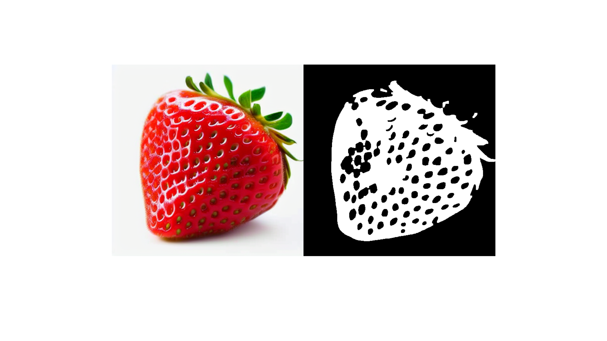

# Deformed-fruits
Deformed fruits

# Dataset Apples Images
The developed dataset comprises a total of 20,000 RGB images, encompassing both real and synthetic images of apples, taking into account their morphological diversity. This collection is evenly distributed with 5,000 samples for each of the four defined classes: Extra Class, First Class, Second Class, and Out of Class. Additionally, the dataset includes 20,000 silhouette images generated from each RGB image.


# Dataset Mangoes Images
The developed dataset comprises a total of 20,000 RGB images, encompassing both real and synthetic images of mangoes, taking into account their morphological diversity. This collection is evenly distributed with 5,000 samples for each of the four defined classes: Extra Class, First Class, Second Class, and Out of Class. Additionally, the dataset includes 20,000 silhouette images generated from each RGB image.


# Dataset Strawberries Images
The developed dataset comprises a total of 20,000 RGB images, encompassing both real and synthetic images of Strawberries, taking into account their morphological diversity. This collection is evenly distributed with 5,000 samples for each of the four defined classes: Extra Class, First Class, Second Class, and Out of Class. Additionally, the dataset includes 20,000 silhouette images generated from each RGB image.



For paper reference (Bibtex)

```
@inproceedings{beltran2024fruit,
  title={Fruit Deformity Classification Through Single-Input and Multi-input Architectures Based on CNN Models Using Real and Synthetic Images},
  author={Beltran, Tommy D and Villao, Raul J and Chuquimarca, Luis E and Vintimilla, Boris X and Velastin, Sergio A},
  booktitle={Iberoamerican Congress on Pattern Recognition},
  pages={46--62},
  year={2024},
  organization={Springer}
}
```
